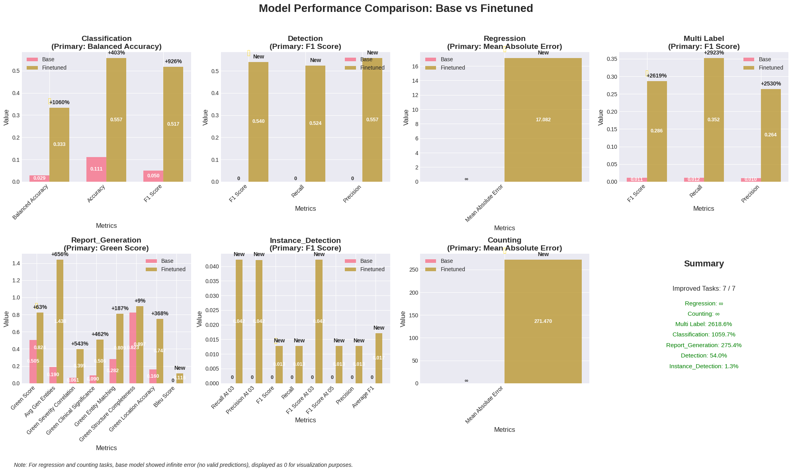

# FLARE 2025 2D MLLM QWen2.5-VL Baseline

This repository provides a baseline implementation for the FLARE 2025 2D multimodal medical image challenge using QWen2.5-VL-7B.

## 🚀 Quick Start with Pre-trained Model

The pre-trained baseline model is available at:

🤗 **Model**: [leoyinn/qwen2.5vl-flare2025](https://huggingface.co/leoyinn/qwen2.5vl-flare2025)

## Overview

The pipeline supports all 19 datasets across 8 medical imaging modalities:
- **Retinography**: retino, fundus
- **Ultrasound**: BUSI-det, BUS-UCLM-det, BUSI, BUS-UCLM, iugc
- **X-ray**: boneresorption, dental, periapical, IU_XRay, chestdr
- **Clinical**: neojaundice
- **Microscopy**: chromosome, neurips22cell, bone_marrow
- **Endoscopy**: endo
- **Dermatology**: bcn20000
- **Mammography**: CMMD

### Supported Task Types:
- Classification (Balanced Accuracy)
- Multi-label Classification (F1 Score)
- Detection (F1 Score @ IoU 0.5)
- Instance Detection (F1 Score @ IoU 0.3/0.5)
- Cell Counting (Mean Absolute Error)
- Regression (Mean Absolute Error)
- Report Generation (Comprehensive GREEN Score)

## Requirements

- Python 3.8+
- CUDA 11.8+ with GPU (minimum 24GB VRAM recommended)
- 100GB+ free disk space for datasets and models

## Installation

```bash
# Clone the repository
git clone <repository-url>

# Create virtual environment
python -m venv venv
source venv/bin/activate  # On Windows: venv\Scripts\activate

# Install dependencies
pip install -r requirements.txt
```

## Quick Start

The easiest way to run the complete pipeline is using the provided script:

```bash
# Make the script executable
chmod +x run_pipeline.sh

# Run the complete pipeline (prepare data, train, and evaluate)
./run_pipeline.sh

# Run with custom configuration
./run_pipeline.sh --config config_custom.yaml

# Run specific steps only
./run_pipeline.sh --prepare-only    # Only prepare data
./run_pipeline.sh --train-only      # Only train (requires prepared data)
./run_pipeline.sh --evaluate-only   # Only evaluate (requires trained model)
```

The `run_pipeline.sh` script will:
1. Validate the dataset structure
2. Prepare the data for training
3. Fine-tune the QWen2.5-VL model
4. Evaluate the model performance
5. Generate comprehensive reports

## Dataset Preparation

The pipeline expects the [FLARE 2025 2D MLLM](https://huggingface.co/datasets/FLARE-MedFM/FLARE-Task5-MLLM-2D) dataset to be organized in the following structure:

```
organized_dataset/
├── training/
│   ├── Retinography/
│   │   ├── retino/
│   │   │   ├── imagesTr/
│   │   │   └── retino_questions_train.json
│   │   └── fundus/
│   │       └── ...
│   └── ...
├── validation-hidden/
│   └── ...
└── validation-public/
    └── ...
```

## Usage

## Usage (Detailed Control)

For users who want more control over individual steps, you can run each component separately:

### 0. Validate Dataset (Optional but Recommended)

```bash
# Validate dataset structure
python validate_dataset.py --base_dir organized_dataset

# Also check image integrity (slower)
python validate_dataset.py --base_dir organized_dataset --check_images
```

### 1. Prepare Data

```bash
# Process all 19 datasets
python prepare_data.py \
    --base_dir organized_dataset \
    --output_dir processed_data_qwenvl

# For testing with subset (3 datasets only)
python prepare_data.py \
    --base_dir organized_dataset \
    --output_dir processed_data_qwenvl_subset \
    --use_subset \
    --max_samples 100
```

### 2. Fine-tune Model

```bash
# Full training
python finetune_qwenvl.py \
    --model_name_or_path Qwen/Qwen2.5-VL-7B-Instruct \
    --processed_data_dir processed_data_qwenvl \
    --output_dir finetuned_qwenvl \
    --num_epochs 3

# Resume from checkpoint
python finetune_qwenvl.py \
    --resume_from_checkpoint finetuned_qwenvl/checkpoint-1000
```

### 3. Evaluate Model

```bash
# Option 1: Use pre-trained baseline model (RECOMMENDED)
python evaluate_model.py \
    --processed_data_dir processed_data_qwenvl \
    --lora_weights leoyinn/qwen2.5vl-flare2025 \
    --output_dir evaluation_results_baseline

# Option 2: Evaluate your fine-tuned model
python evaluate_model.py \
    --processed_data_dir processed_data_qwenvl \
    --lora_weights finetuned_qwenvl/final \
    --output_dir evaluation_results

# Option 3: Compare with base model (no fine-tuning)
python evaluate_model.py \
    --processed_data_dir processed_data_qwenvl \
    --lora_weights finetuned_qwenvl/final \
    --evaluate_base_model \
    --output_dir evaluation_results_comparison
```

### 4. Inference

#### Basic Inference

```bash
# Single image inference
python inference.py \
    --model_name finetuned_qwenvl/final \
    --image_path chest_xray.jpg \
    --task classification \
    --prompt "What abnormalities are present in this chest X-ray?"
```

#### Batch Processing with Question File

For processing multiple images with specific questions, use a JSON question file:

```bash
python inference.py \
    --model_name leoyinn/qwen2.5vl-flare2025 \
    --questions_file questions.json \
    --output results.json \
    --verbose
```

#### Question File Format

```json
[
    {
        "TaskType": "Classification",
        "Modality": "Clinical",
        "ImageName": "organized_dataset/training/Clinical/neojaundice/imagesTr/NeoJaundice_00001-1.jpg",
        "Question": "Is therapeutic intervention required for this jaundiced newborn? A. No Treatment, B. Treatment Required",
        "Split": "test"
    },
    {
        "TaskType": "Detection",
        "Modality": "Ultrasound",
        "ImageName": "organized_dataset/testing/Ultrasound/iugc/imagesTs/IUGC_00577-18.png",
        "Question": "Define the position of fetal head using its bounding box coordinates.",
        "Split": "test"
    }
]
```

### Advanced Options

```bash
inference.py [-h] [--model_name MODEL_NAME] [--device {cuda,cpu,auto}] [--no_quantize] [--image_path IMAGE_PATH] [--image_folder IMAGE_FOLDER] [--file_pattern FILE_PATTERN]
                    [--questions_file QUESTIONS_FILE] [--task {classification,multi_label,detection,counting,report_generation,vqa}] [--prompt PROMPT] [--question QUESTION]
                    [--target TARGET] [--max_tokens MAX_TOKENS] [--temperature TEMPERATURE] [--batch_size BATCH_SIZE] [--output OUTPUT] [--verbose]
```

### Output Format

The inference script produces structured JSON output:

```json
{
    "image_path": "chest_xray.jpg",
    "task": "classification",
    "prompt": "What abnormalities are present?",
    "raw_response": "The chest X-ray shows bilateral pulmonary infiltrates...",
    "parsed_result": {
        "diagnosis": "Bilateral pneumonia",
        "confidence": 0.85
    },
    "metadata": {
        "model": "leoyinn/qwen2.5vl-flare2025",
        "temperature": 0.1,
        "max_tokens": 128
    }
}
```

## Pre-trained Baseline Model

### Model Details
- **Base Model**: Qwen2.5-VL-7B-Instruct
- **Fine-tuning**: QLoRA (4-bit quantization)
- **Training Data**: All 19 FLARE 2025 datasets
- **Parameters**: ~7B base + LoRA adapters
- **Download**: [leoyinn/qwen2.5vl-flare2025](https://huggingface.co/leoyinn/qwen2.5vl-flare2025)


## Key Features

### Memory Optimization
- 4-bit quantization with QLoRA
- Dynamic batch sizing based on available GPU memory
- Image caching with LRU eviction
- Gradient checkpointing

### Training Strategy
- Only trains on assistant responses (proper instruction masking)
- Task-specific prompt engineering
- Early stopping with patience
- Cosine learning rate schedule with warmup

### Evaluation Metrics
- Comprehensive metrics per task type
- Multiple IoU thresholds for detection tasks (0.3-0.7)
- Per-chromosome breakdown for instance detection
- Detailed comparison reports
- GREEN Score for report generation with:
  - Clinical entity matching with severity assessment
  - Anatomical location grounding with laterality
  - Temporal information consistency
  - Size/measurement accuracy
  - Uncertainty and negation handling
  - Clinical significance weighting
  - Report structure evaluation

## Configuration Options

### prepare_data.py
- `--max_samples`: Limit samples per dataset for prototyping
- `--use_subset`: Use only 3 datasets for testing

### finetune_qwenvl.py
- `--batch_size`: Per-device batch size (auto-determined by default)
- `--gradient_accumulation_steps`: Steps to accumulate gradients
- `--num_epochs`: Number of training epochs (default: 3)
- `--lora_rank`: LoRA rank (default: 16)
- `--early_stopping_patience`: Early stopping patience (default: 5)

### evaluate_model.py
- `--max_eval_samples`: Limit evaluation samples per task
- `--save_predictions`: Save individual predictions
- `--lora_weights`: Path to LoRA weights (local path or HuggingFace model ID like leoyinn/qwen2.5vl-flare2025)
- `--evaluate_base_model`: Compare with base model (default: True)

## Performance Notes

### System Requirements
- **Training**: ~20GB GPU memory with default settings
- **Inference**: ~8GB GPU memory (with pre-trained model)
- **Training Time**: 24-48 hours on A100 for full dataset
- **Evaluation Time**: 2-4 hours depending on dataset size

### Baseline Performance Results

The pre-trained model shows significant improvements over the base QWen2.5-VL model across all FLARE 2025 tasks:



#### Primary Metrics Improvements (Base → Fine-tuned):

| Task Type                      | Primary Metric      | Base Model | Fine-tuned | Improvement |
| ------------------------------ | ------------------- | ---------- | ---------- | ----------- |
| **Classification**             | Balanced Accuracy   | 0.0287     | 0.3330     | ↑ 1059.7%   |
| **Detection**                  | F1 Score loU>0.5    | 0.0000     | 0.5399     | ↑ 54.0%     |
| **Multi-label Classification** | F1 Score            | 0.0105     | 0.2862     | ↑ 2618.6%   |
| **Report Generation**          | GREEN Score         | 0.5045     | 0.8238     | ↑ 63.3%     |
| **Instance Detection**         | F1 Score loU>0.5    | 0.0000     | 0.0127     | ↑ 1.3%      |
| **Regression**                 | Mean Absolute Error | ∞          | 17.0816    | ↑ inf       |
| **Counting**                   | Mean Absolute Error | ∞          | 271.4700   | ↑ inf       |

> **Note**: The base model showed infinite errors for regression and counting tasks (no valid predictions), while the fine-tuned model produces meaningful numerical outputs.


### Benchmarking
Use the pre-trained model as a baseline to:
- Compare your fine-tuned models against
- Quick start for FLARE 2025 submissions
- Understand expected performance ranges
- Validate your data preparation pipeline

## Troubleshooting

### CUDA Out of Memory
- Reduce batch size or increase gradient accumulation
- Ensure no other processes are using GPU
- Check GPU memory with `nvidia-smi`

### Token/Feature Mismatch
- Fixed by locking image resolution to 448x448
- Ensure processor configuration is not modified

### Slow Data Loading
- Increase image cache size if RAM permits
- Use SSD for dataset storage
- Check image file integrity

## Citation

If you use this baseline in your research, please cite:

```bibtex
@misc{qwen25vl-flare2025,
  title={QWen2.5VL Fine-tuned for FLARE 2025 Medical Image Analysis},
  author={Shuolin Yin},
  year={2025},
  publisher={Hugging Face},
  url={https://huggingface.co/leoyinn/qwen2.5vl-flare2025}
}

@misc{qwen25vl-base,
  title={Qwen2.5-VL: Enhancing Vision-Language Model's Perception of the World at Any Resolution},
  author={Qwen Team},
  year={2024},
  publisher={Hugging Face},
  url={https://huggingface.co/Qwen/Qwen2.5-VL-7B-Instruct}
}
```

## License

This project is licensed under the MIT License - see the LICENSE file for details.

## Dataset Access

The FLARE 2025 datasets can be accessed at:
- **Main Dataset**: [FLARE-MedFM/FLARE-Task5-MLLM-2D](https://huggingface.co/datasets/FLARE-MedFM/FLARE-Task5-MLLM-2D)
- **Challenge Info**: [FLARE 2025 Official Website](https://flare-medfm.github.io/)

## Acknowledgments

- QWen team for the base model
- FLARE 2025 organizers for the dataset and challenge
- HuggingFace for the transformers library and model hosting
- Medical imaging communities for the public datasets 